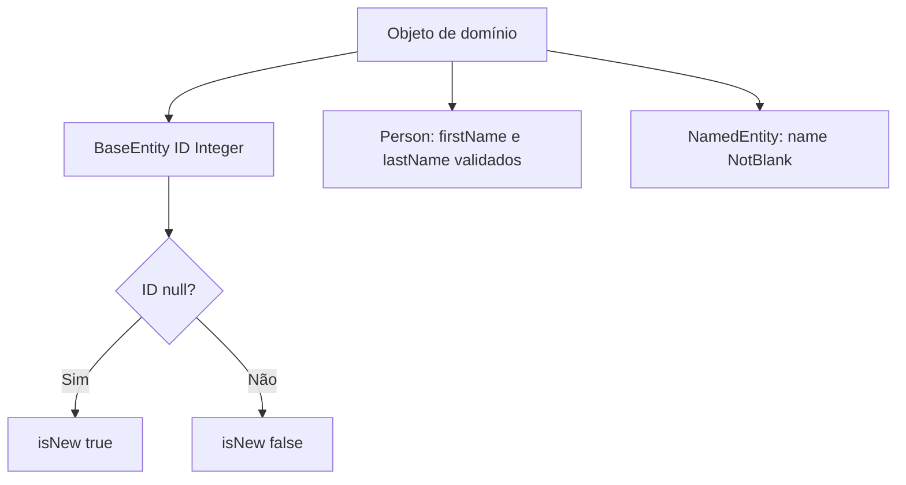

# Fluxo das classes base

🟢 CONFIRMADO — derivado do código Java; análise estática.

```mermaid
flowchart TD
A[Objeto de domínio] --> B[BaseEntity ID Integer]
B --> C{ID null?}
C -->|Sim| D[isNew true]
C -->|Não| E[isNew false]
A --> F[Person: firstName e lastName validados]
A --> G[NamedEntity: name NotBlank]
```
