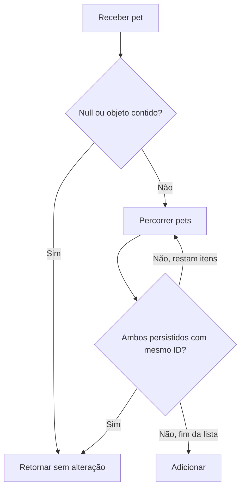

# Owner.addPet

🟢 CONFIRMADO — derivado do código Java; análise estática.

```mermaid
flowchart TD
A[Receber pet] --> B{Null ou objeto contido?}
B -->|Sim| C[Retornar sem alteração]
B -->|Não| D[Percorrer pets]
D --> E{Ambos persistidos com mesmo ID?}
E -->|Sim| C
E -->|Não, restam itens| D
E -->|Não, fim da lista| F[Adicionar]
```
