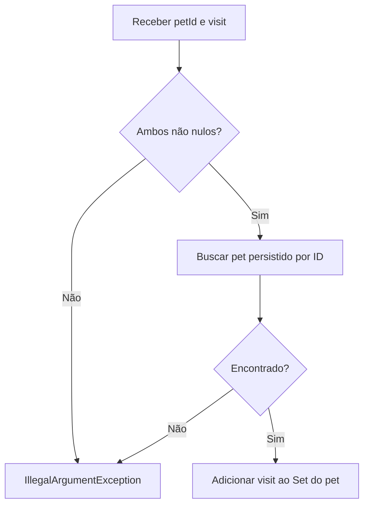

# Owner.addVisit

🟢 CONFIRMADO — derivado do código Java; análise estática.

```mermaid
flowchart TD
A[Receber petId e visit] --> B{Ambos não nulos?}
B -->|Não| C[IllegalArgumentException]
B -->|Sim| D[Buscar pet persistido por ID]
D --> E{Encontrado?}
E -->|Não| C
E -->|Sim| F[Adicionar visit ao Set do pet]
```
