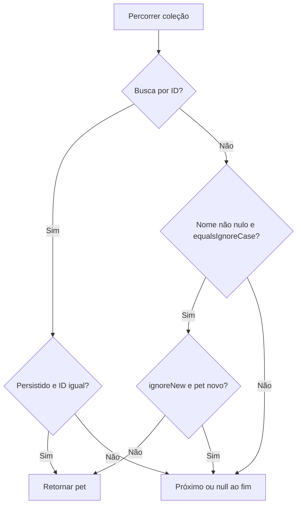

# Owner.getPet por nome ou ID

🟢 CONFIRMADO — derivado do código Java; análise estática.

```mermaid
flowchart TD
A[Percorrer coleção] --> B{Busca por ID?}
B -->|Sim| C{Persistido e ID igual?}
B -->|Não| D{Nome não nulo e equalsIgnoreCase?}
D -->|Sim| E{ignoreNew e pet novo?}
E -->|Não| F[Retornar pet]
C -->|Sim| F
C -->|Não| G[Próximo ou null ao fim]
D -->|Não| G
E -->|Sim| G
```
