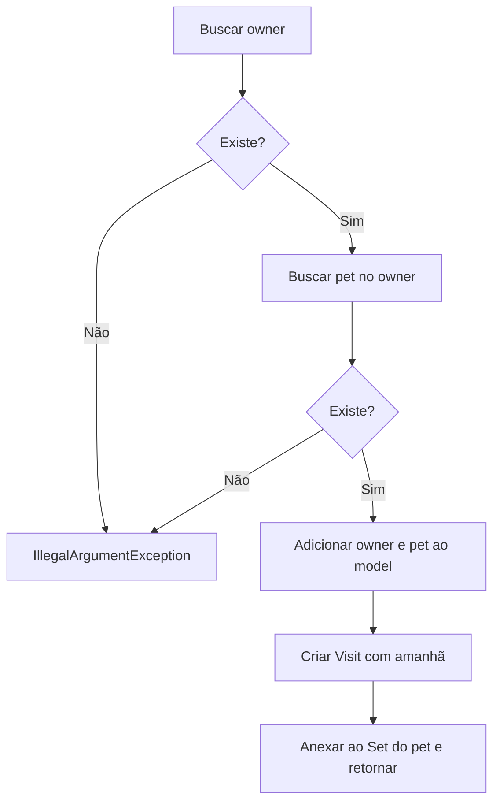

# VisitController.loadPetWithVisit

🟢 CONFIRMADO — derivado do código Java; análise estática.

```mermaid
flowchart TD
A[Buscar owner] --> B{Existe?}
B -->|Não| C[IllegalArgumentException]
B -->|Sim| D[Buscar pet no owner]
D --> E{Existe?}
E -->|Não| C
E -->|Sim| F[Adicionar owner e pet ao model]
F --> G[Criar Visit com amanhã]
G --> H[Anexar ao Set do pet e retornar]
```
