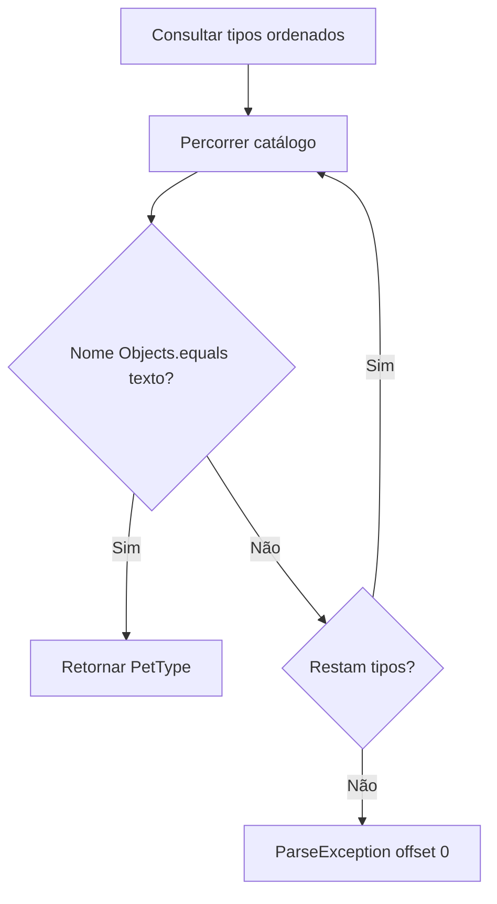

# PetTypeFormatter.parse

🟢 CONFIRMADO — derivado do código Java; análise estática.

```mermaid
flowchart TD
A[Consultar tipos ordenados] --> B[Percorrer catálogo]
B --> C{Nome Objects.equals texto?}
C -->|Sim| D[Retornar PetType]
C -->|Não| E{Restam tipos?}
E -->|Sim| B
E -->|Não| F[ParseException offset 0]
```
