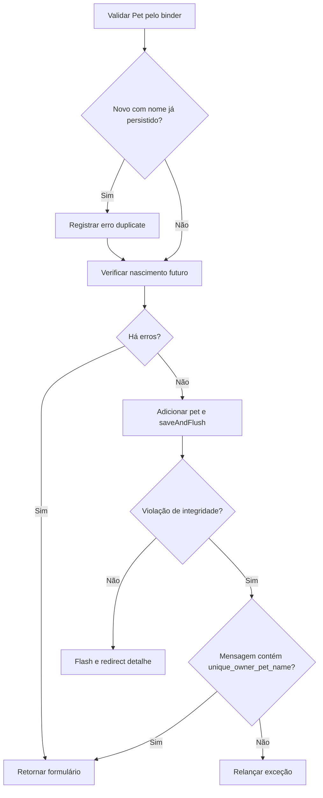

# PetController.processCreationForm

🟢 CONFIRMADO — derivado do código Java; análise estática.

```mermaid
flowchart TD
A[Validar Pet pelo binder] --> B{Novo com nome já persistido?}
B -->|Sim| C[Registrar erro duplicate]
B -->|Não| D[Verificar nascimento futuro]
C --> D
D --> E{Há erros?}
E -->|Sim| F[Retornar formulário]
E -->|Não| G[Adicionar pet e saveAndFlush]
G --> H{Violação de integridade?}
H -->|Não| I[Flash e redirect detalhe]
H -->|Sim| J{Mensagem contém unique_owner_pet_name?}
J -->|Sim| F
J -->|Não| K[Relançar exceção]
```
