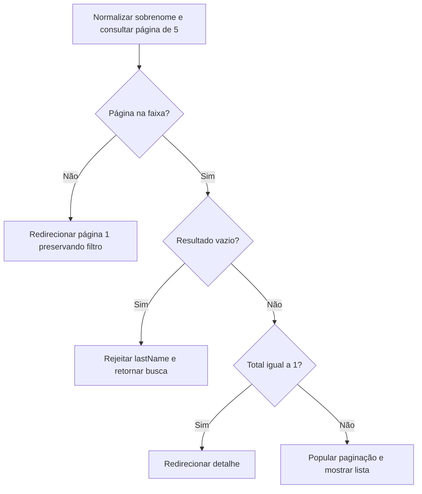

# OwnerController.processFindForm

🟢 CONFIRMADO — derivado do código Java; análise estática.

```mermaid
flowchart TD
A[Normalizar sobrenome e consultar página de 5] --> B{Página na faixa?}
B -->|Não| C[Redirecionar página 1 preservando filtro]
B -->|Sim| D{Resultado vazio?}
D -->|Sim| E[Rejeitar lastName e retornar busca]
D -->|Não| F{Total igual a 1?}
F -->|Sim| G[Redirecionar detalhe]
F -->|Não| H[Popular paginação e mostrar lista]
```
