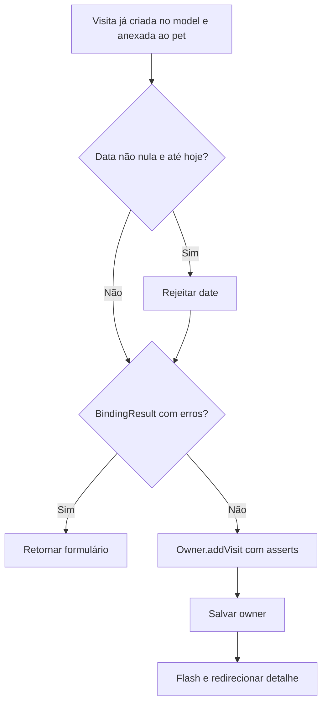

# VisitController.processNewVisitForm

🟢 CONFIRMADO — derivado do código Java; análise estática.

```mermaid
flowchart TD
A[Visita já criada no model e anexada ao pet] --> B{Data não nula e até hoje?}
B -->|Sim| C[Rejeitar date]
B -->|Não| D{BindingResult com erros?}
C --> D
D -->|Sim| E[Retornar formulário]
D -->|Não| F[Owner.addVisit com asserts]
F --> G[Salvar owner]
G --> H[Flash e redirecionar detalhe]
```
