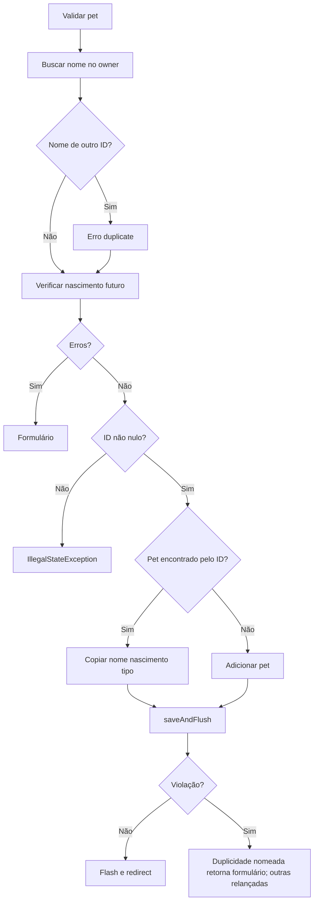

# PetController.processUpdateForm e updatePetDetails

🟢 CONFIRMADO — derivado do código Java; análise estática.

```mermaid
flowchart TD
A[Validar pet] --> B[Buscar nome no owner]
B --> C{Nome de outro ID?}
C -->|Sim| D[Erro duplicate]
C -->|Não| E[Verificar nascimento futuro]
D --> E
E --> F{Erros?}
F -->|Sim| G[Formulário]
F -->|Não| H{ID não nulo?}
H -->|Não| I[IllegalStateException]
H -->|Sim| J{Pet encontrado pelo ID?}
J -->|Sim| K[Copiar nome nascimento tipo]
J -->|Não| L[Adicionar pet]
K --> M[saveAndFlush]
L --> M
M --> N{Violação?}
N -->|Não| O[Flash e redirect]
N -->|Sim| P[Duplicidade nomeada retorna formulário; outras relançadas]
```
