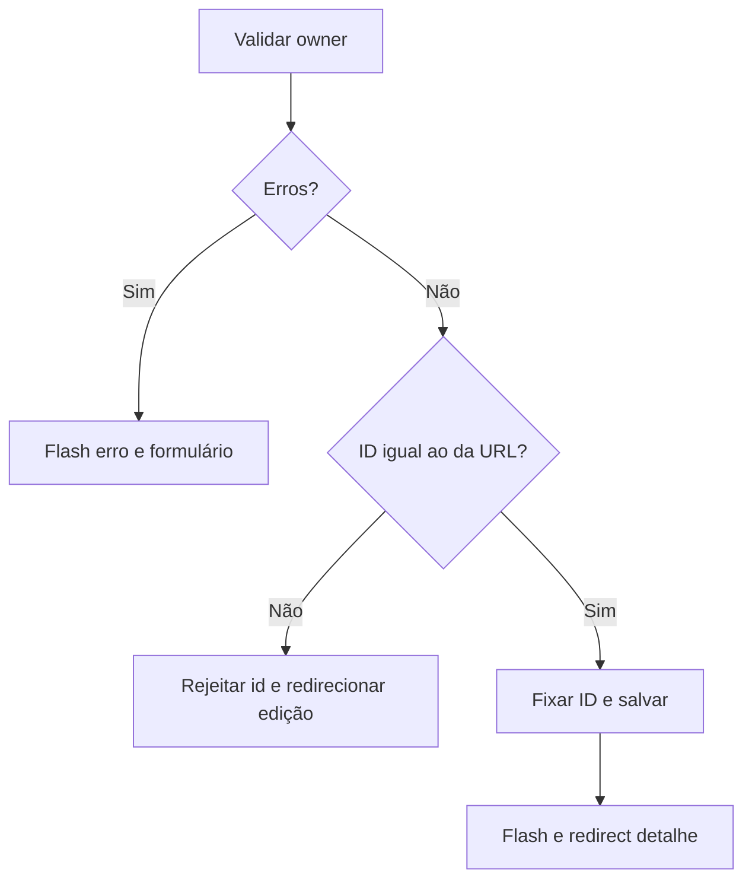

# OwnerController.processUpdateOwnerForm

🟢 CONFIRMADO — derivado do código Java; análise estática.

```mermaid
flowchart TD
A[Validar owner] --> B{Erros?}
B -->|Sim| C[Flash erro e formulário]
B -->|Não| D{ID igual ao da URL?}
D -->|Não| E[Rejeitar id e redirecionar edição]
D -->|Sim| F[Fixar ID e salvar]
F --> G[Flash e redirect detalhe]
```
