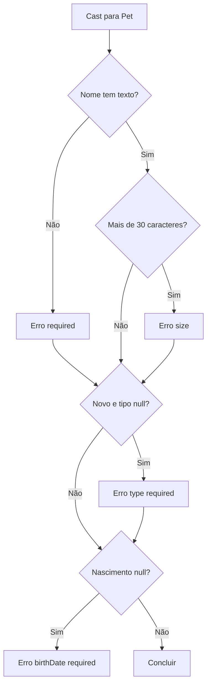

# PetValidator.validate

🟢 CONFIRMADO — derivado do código Java; análise estática.

```mermaid
flowchart TD
A[Cast para Pet] --> B{Nome tem texto?}
B -->|Não| C[Erro required]
B -->|Sim| D{Mais de 30 caracteres?}
D -->|Sim| E[Erro size]
C --> F{Novo e tipo null?}
D -->|Não| F
E --> F
F -->|Sim| G[Erro type required]
F -->|Não| H{Nascimento null?}
G --> H
H -->|Sim| I[Erro birthDate required]
H -->|Não| J[Concluir]
```
