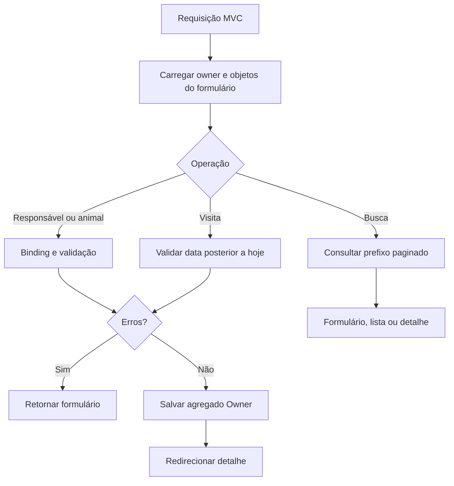

# Fluxo do módulo owner

🟢 CONFIRMADO — derivado do código Java; análise estática.

```mermaid
flowchart TD
A[Requisição MVC] --> B[Carregar owner e objetos do formulário]
B --> C{Operação}
C -->|Busca| D[Consultar prefixo paginado]
C -->|Responsável ou animal| E[Binding e validação]
C -->|Visita| F[Validar data posterior a hoje]
E --> G{Erros?}
F --> G
G -->|Sim| H[Retornar formulário]
G -->|Não| I[Salvar agregado Owner]
I --> J[Redirecionar detalhe]
D --> K[Formulário, lista ou detalhe]
```
