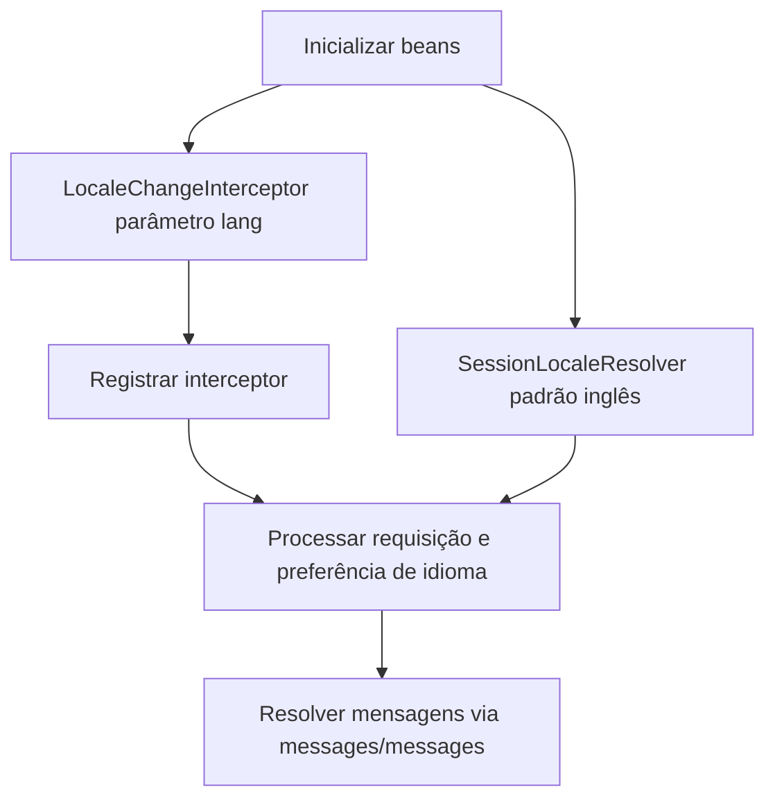

# Configuração e troca de idioma

🟢 CONFIRMADO — configuração declarada no código; efeitos internos de framework não foram executados.

```mermaid
flowchart TD
A[Inicializar beans] --> B[SessionLocaleResolver padrão inglês]
A --> C[LocaleChangeInterceptor parâmetro lang]
C --> D[Registrar interceptor]
D --> E[Processar requisição e preferência de idioma]
B --> E
E --> F[Resolver mensagens via messages/messages]
```
