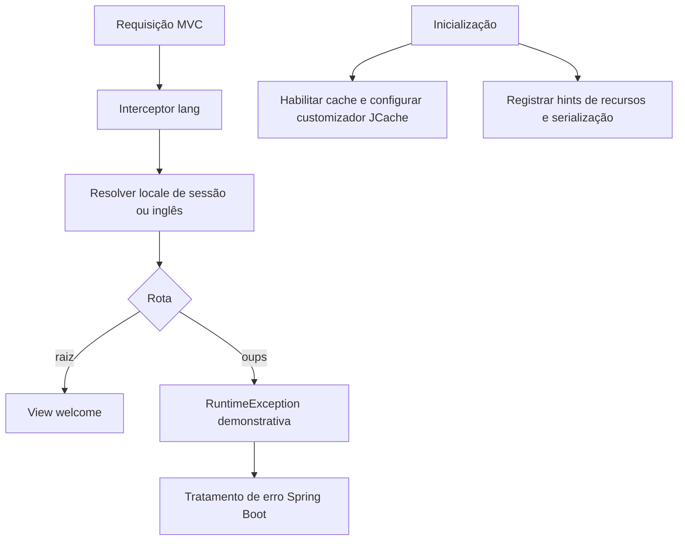

# Fluxo de system

🟢 CONFIRMADO — configuração declarada no código; efeitos internos de framework não foram executados.

```mermaid
flowchart TD
A[Requisição MVC] --> B[Interceptor lang]
B --> C[Resolver locale de sessão ou inglês]
C --> D{Rota}
D -->|raiz| E[View welcome]
D -->|oups| F[RuntimeException demonstrativa]
F --> G[Tratamento de erro Spring Boot]
H[Inicialização] --> I[Habilitar cache e configurar customizador JCache]
H --> J[Registrar hints de recursos e serialização]
```
