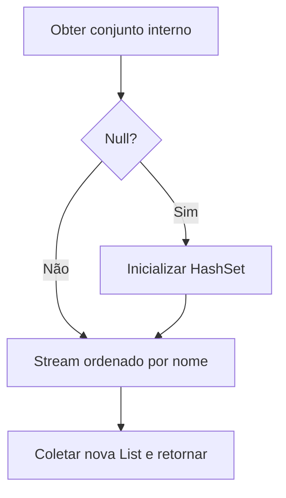

# Vet.getSpecialties

🟢 CONFIRMADO — derivado do código Java; análise estática.

```mermaid
flowchart TD
A[Obter conjunto interno] --> B{Null?}
B -->|Sim| C[Inicializar HashSet]
B -->|Não| D[Stream ordenado por nome]
C --> D
D --> E[Coletar nova List e retornar]
```
