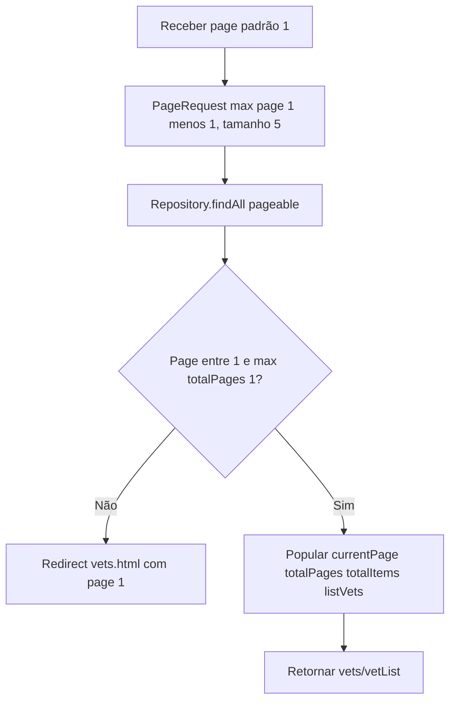

# VetController.showVetList

🟢 CONFIRMADO — derivado do código Java; análise estática.

```mermaid
flowchart TD
A[Receber page padrão 1] --> B[PageRequest max page 1 menos 1, tamanho 5]
B --> C[Repository.findAll pageable]
C --> D{Page entre 1 e max totalPages 1?}
D -->|Não| E[Redirect vets.html com page 1]
D -->|Sim| F[Popular currentPage totalPages totalItems listVets]
F --> G[Retornar vets/vetList]
```
