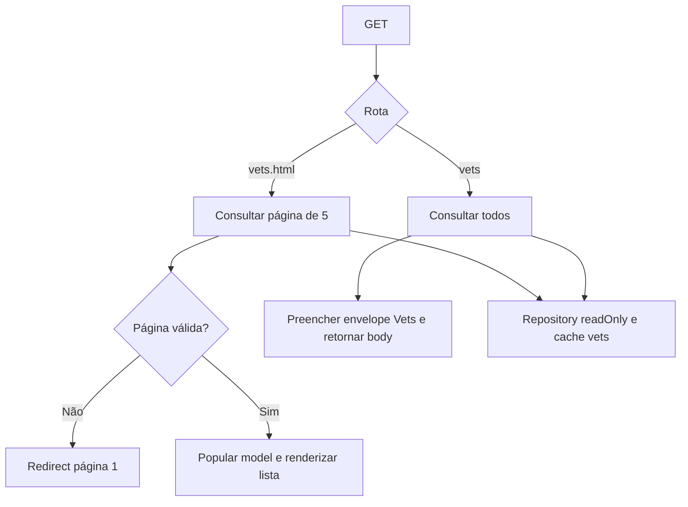

# Fluxo do módulo vet

🟢 CONFIRMADO — derivado do código Java; análise estática.

```mermaid
flowchart TD
A[GET] --> B{Rota}
B -->|vets.html| C[Consultar página de 5]
C --> D{Página válida?}
D -->|Não| E[Redirect página 1]
D -->|Sim| F[Popular model e renderizar lista]
B -->|vets| G[Consultar todos]
G --> H[Preencher envelope Vets e retornar body]
C --> I[Repository readOnly e cache vets]
G --> I
```
